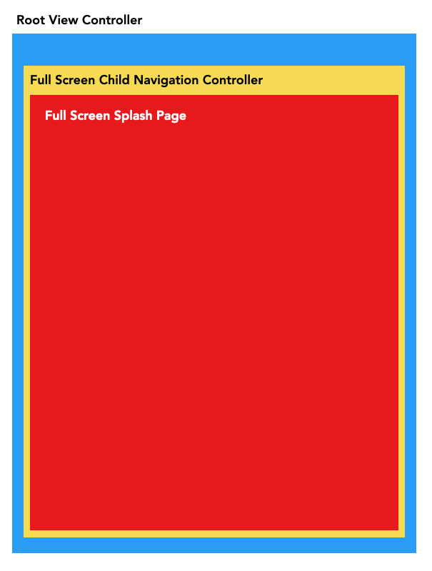

## Initial Setup:
### Asset Setup:

1. Create Asset Catalog with Fonts, Colors, and Images
2. Create Constants to easily asset catalog values

**Fonts**: 
  
*Splash Page Fonts*: Splash page title, splash page prompt, Splash page sign out, splash page main buttons

*Input Page Fonts*: Prompt font, input button font, textfield font

**Colors**:
  
Background View, Buttons, Splash Labels, Input prompt, scrolling highlight, Textfield Tint

**Images**:
  
 *Input Page*: email icon, pen icon, close icon, clear icon

3. Create static functions to generate reusable buttons and labels

---
### Complex Views Setup:
**Input TextField**:
- Parent Vertical StackView
- Child TextFieldStackView
- Wrap right-aligned button in container view

### Navigation
- Navigation Controller with the ability to re-order views.

---

### Landing Page 
**Embedded in Navigation Controller**
**Two modes:**
1. Presentation
2. Thank You

### Root Input View
1. Presented View Controller
2. Input Views are contained in child navigation controller

